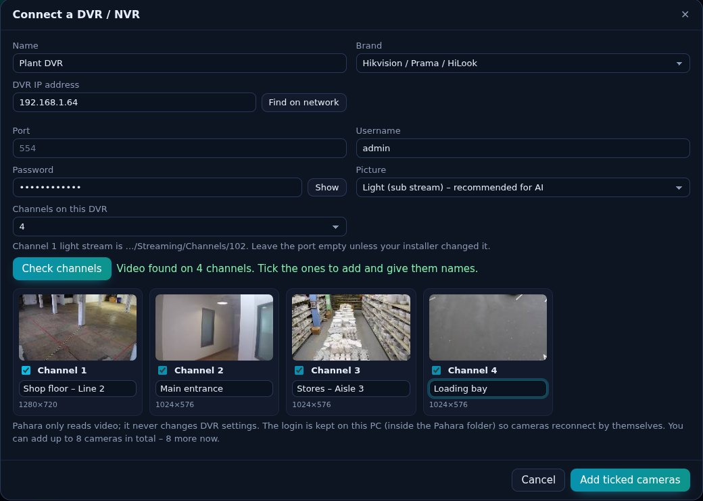
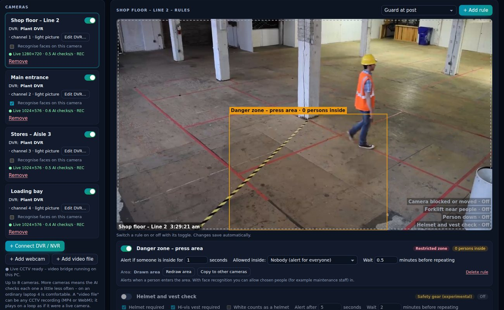

# Pahara – test version for Windows

**Pahara turns the CCTV you already have into an AI control room.** It watches your cameras and raises an alert when something needs attention, such as a person in a danger area, a fire, or someone on site after hours.

*by Nikkhil Deshmukkh · Version 3.1.1 (test version)*

<!-- web-only -->
## ⬇️ [Download Pahara for Windows](https://github.com/keedaaa/pahara-downloads/releases/latest/download/Pahara-Setup.exe)

Windows 10 or 11 (64-bit) · about 20 MB · free for testers
<!-- /web-only -->

**This guide in 4 steps:** [1. Install](#step-1--install-pahara) · [2. Get your DVR / NVR details](#step-2--get-your-dvr--nvr-details) · [3. Connect your cameras](#step-3--connect-your-cameras) · [4. Try it](#step-4--try-it) · [If something does not work](#if-something-does-not-work) · [Send feedback](#send-your-feedback)

---

## Before you start

You need four things:

- [ ] **A Windows 10 or 11 PC or laptop.** 8 GB of RAM is best.
- [ ] **The PC at the same place as the DVR / NVR**, connected to the **same router** (by cable or Wi-Fi). Pahara cannot reach a DVR at another location, and it cannot use the phone app's cloud.
- [ ] **The DVR / NVR's IP address, username and password.** Step 2 shows you how to find them.
- [ ] **Google Chrome or Microsoft Edge.** Edge is already on every Windows PC.

> **DVR or NVR?** A DVR has cameras connected with round, TV-style cables. An NVR has cameras connected with network (LAN) cables. Pahara connects to both in exactly the same way.

---

## Step 1 – Install Pahara

1. Click **[Download Pahara for Windows](https://github.com/keedaaa/pahara-downloads/releases/latest/download/Pahara-Setup.exe)**.
2. Your browser may warn you, because the test version is new and not yet signed with a paid certificate:
   - **Edge:** "Pahara-Setup.exe isn't commonly downloaded". Click **⋯**, then **Keep**, then **Show more**, then **Keep anyway**.
   - **Chrome:** click **Keep**.
3. Open **Pahara-Setup.exe** from your Downloads.
4. If a blue **"Windows protected your PC"** box appears, click **More info**, then **Run anyway**.
5. Click **Install**, then **Finish**. Leave **"Start Pahara now"** ticked.
6. Pahara opens in its own window. A small **"Pahara video bridge"** window also appears in the taskbar. **Leave it open**, because it brings the camera video in.
7. If **Windows Firewall** asks about **go2rtc**, tick **Private networks** and click **Allow**.
8. Sign in: choose **Factory owner** and type the PIN **1111**. You can change the PINs later in *Admin & privacy*.

From now on, open Pahara with the **Pahara** icon on your desktop.

---

## Step 2 – Get your DVR / NVR details

### 2a. Find the brand

Look for the logo on the DVR / NVR box, or on its start-up or login screen on the TV. You can also check which **phone app** you use to watch your cameras:

| Phone app you use | Choose this brand in Pahara |
|---|---|
| Hik-Connect, Hik-Partner Pro, iVMS-4500 | **Hikvision / Prama / HiLook** |
| CP Plus, gCMOB, DMSS, iDMSS, gDMSS | **CP Plus / Dahua** |
| XMEye, XMEye Pro, iCSee | **XMEye / NetSurveillance type** |
| EZView, UNV | **Uniview (UNV)** |

Still not sure? That's fine. Step 3 shows you how to try the brands one by one.

### 2b. Find the IP address

The IP address is four numbers with dots, for example **192.168.1.64**.

**Hikvision DVR / NVR**, on the TV or monitor connected to it:

1. Right-click anywhere on the screen and choose **Menu**. Log in.
2. Go to **Configuration** (on newer models: **System**), then **Network**, then **General** (or **TCP/IP**).
3. Note the **IPv4 Address**.

**Other brands:** **Main Menu**, then **Network** (sometimes **System**, then **Network**, then **TCP/IP**).

**No TV connected to the DVR?** Pahara can search for it with the **Find on network** button in Step 3. You can also ask your CCTV installer.

### 2c. Username and password

- The username is usually **admin**.
- The password is the one you type **on the DVR's own screen**.
- **Hikvision:** use the **device password**, *not* your Hik-Connect app account password.
- Type it carefully. Hikvision blocks logins for about 30 minutes after several wrong passwords. Pahara tries only once and never keeps retrying, so it will not lock you out.

### 2d. Quick check: can this PC see the DVR?

Open Chrome or Edge, type `http://192.168.1.64` in the address bar (use **your** IP address), and press Enter.

- **A login page appears:** good, the PC can reach the DVR. You don't need to log in.
- **"This site can't be reached":** the PC is not on the same network, or the IP address is wrong. Check the cable or Wi-Fi first.

---

## Step 3 – Connect your cameras

1. In Pahara's left menu, click **Cameras & rules**, then **+ Connect DVR / NVR**.
2. Fill in the form:

| Box | What to type or choose |
|---|---|
| **Name** | Anything, for example *Plant DVR* |
| **Brand** | From Step 2a. For a Hikvision DVR, choose **Hikvision / Prama / HiLook** |
| **DVR IP address** | From Step 2b. Or click **Find on network** and pick your DVR from the list |
| **Port** | **Leave it empty** |
| **Username / Password** | From Step 2c |
| **Picture** | Leave it on **Light (sub stream) – recommended for AI** |
| **Channels on this DVR** | How many cameras it can take (4, 8, 16 or 32). This is written on the box or sticker, for example "8CH". If you're not sure, choose the bigger number. |

3. Click **Check channels** and wait 10–30 seconds. A small picture appears for every camera that works.
4. Tick the cameras you want (up to 8; **start with 2 to 4**) and give each one a name, such as *Main gate*.
5. Click **Add ticked cameras**.
6. Pahara starts with a demo **Laptop camera** in the list. If you don't need it, click **Remove** under it.

### Connecting an NVR (or if you're not sure of the brand)

The steps are the same, with these differences:

- **Not sure of the brand?** Try **Hikvision** first, then **CP Plus / Dahua**, then **XMEye**, then **Uniview**. A wrong brand only shows "No video on channel…"; it will not lock the NVR.
- **Find on network** may also list the individual IP cameras. Always pick the **NVR's** address, not a camera's.
- **Channel 1** is camera 1 on the NVR's screen (often called *D1* or *IP Camera 01*).
- Cameras plugged straight into the back of the NVR (PoE ports) are fine. Pahara only talks to the NVR.

---

## Step 4 – Try it

1. In **Cameras & rules**, click one of your cameras. Its picture opens on the right.
2. Above the picture, choose **Restricted zone** in the list next to **+ Add rule**, then click **+ Add rule**. A box appears on the picture: this is the danger area. To move it, press **Redraw area** and drag a new box on the picture with the mouse.
3. Click **▶ Start monitoring** (the green button at the top right).
4. Walk into the area in front of the camera and stay there for 2–3 seconds. An **alert with a photo** pops up and the PC beeps.
5. Look around: **Command centre** (overview), **Live cameras** (full screen and video wall), **Alerts**, **Smart search** (type *"people today"*).
6. If you can, **leave it running for an hour or a shift**, then check how many alerts were real and how many were false alarms.

**Tips**
- Keep the laptop plugged in, and set it not to sleep while testing.
- The Pahara window can stay behind other windows; it keeps watching.
- **Every day:** open Pahara with the desktop icon, sign in, and press **Start monitoring**. **To stop:** close the Pahara window, then open **Start menu → Pahara → Stop Pahara**.

---

## If something does not work

Pahara shows a plain-English message. Find yours here:

| Pahara says | What to do |
|---|---|
| **Wrong username or password** | Use the same login as on the DVR's screen (for Hikvision, the device password, not the Hik-Connect password). |
| **Cannot reach …** | Check the IP address and that the PC is on the same network. Try the browser check in Step 2d. |
| **…refused the video connection (port …)** | The DVR's RTSP port was changed, or RTSP is switched off. On a Hikvision DVR, go to **Configuration → Network → Advanced Settings (or More Settings)**: note the **RTSP port** (usually 554) and type it into Pahara's **Port** box. |
| **…a format this computer cannot show** | In the DVR menu, set the camera's **sub-stream** to **H.264**. On Hikvision: **Configuration → Record → Parameters (or Encoding) → Sub-stream → Video encoding: H.264**, and switch off **H.264+ / H.265+**. Then press **Check channels** again. |
| **No video on channel …** | That channel has no camera, or the brand is wrong. Try the other brands (see Step 3). |
| **Some cameras work, others don't** | DVRs send only a few live videos at a time. Close the phone app and any other viewing software, or add fewer cameras. |
| **Pahara window does not open** | Open **Start menu → Pahara → Stop Pahara**, then open Pahara again. If that doesn't help, restart the PC. |
| **Video is slow or jerky** | Use fewer cameras and keep **Light (sub stream)** selected. |

---

## Send your feedback

Please send these to Nikhil (WhatsApp is fine):

1. **DVR / NVR brand and model.** On Hikvision: **Menu → Maintenance → System Info**.
2. Did the installation go smoothly?
3. Did **Check channels** find all your cameras?
4. A screenshot of any error. Press **Windows key + Shift + S** to take one.
5. After an hour or a shift: how many alerts were real, and how many were false alarms?
6. Anything that was confusing or that you wished it did.

---

## Your privacy and your DVR

- Pahara only **reads** video. It never changes DVR settings, and it does not affect recording.
- Your video stays **on this PC**. Nothing is uploaded.
- The DVR password is saved **only on this PC**, in Pahara's folder.
- **To uninstall:** Windows **Settings → Apps → Installed apps → Pahara → Uninstall**. It asks whether to keep your Pahara data (camera logins, alerts and settings).

## Good to know about this test version

- One PC handles up to **8 cameras**; 4 runs comfortably on an ordinary laptop.
- The PC must be at the same place as the DVR / NVR, on the same network.
- After the PC restarts, open Pahara and press **Start monitoring** again.
<!-- web-only -->
- **Can't run the installer** (for example, an office PC that blocks installs)? Download the **[zip version](https://github.com/keedaaa/pahara-downloads/releases/latest/download/Pahara-Live-Windows.zip)** instead. Right-click it, choose **Properties**, tick **Unblock** and click **OK**. Then right-click it again, choose **Extract All**, open the folder and double-click **Start Pahara**.
<!-- /web-only -->

---

*Pahara · by Nikkhil Deshmukkh · test version 3.1.1. The video bridge inside Pahara is go2rtc (MIT licence).*
